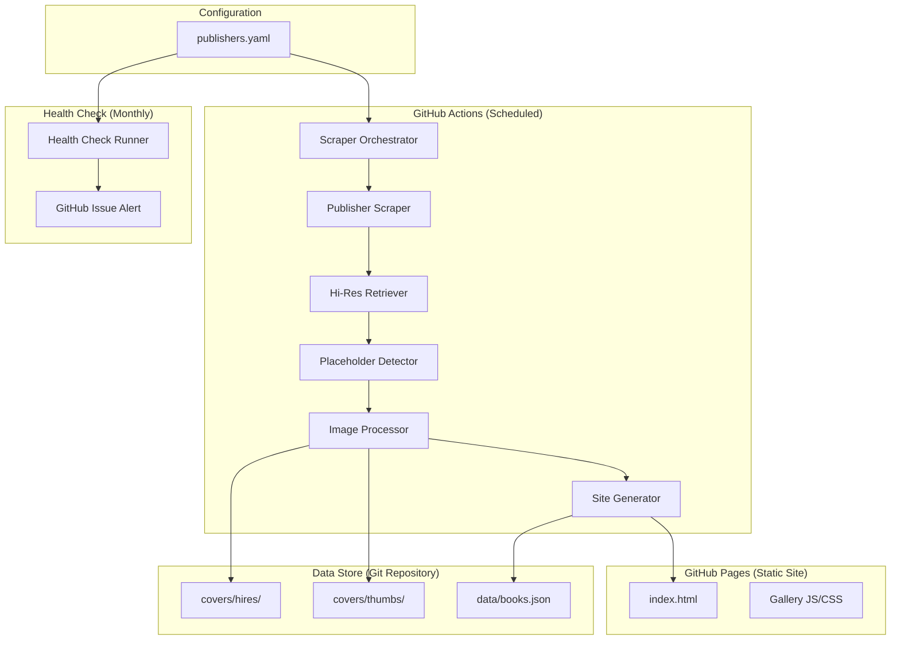

# Design Document: Forthcoming Covers Gallery

## Overview

This system is a free, automated pipeline that scrapes forthcoming book covers from ~40 publisher websites, processes them into a browsable static gallery, and hosts the result on GitHub Pages. The architecture is designed around three core constraints:

1. **Zero cost** — GitHub Pages for hosting, GitHub Actions for automation (2,000 free minutes/month on public repos)
2. **Non-developer maintainability** — all publisher-specific configuration lives in human-readable YAML files with inline documentation
3. **Diverse publisher sites** — a headless browser (Playwright) handles JavaScript-rendered pages, carousels, pagination, and multi-click navigation

The system runs as a scheduled GitHub Actions workflow that scrapes publishers, retrieves hi-res images, detects placeholders, generates thumbnails, and rebuilds the static site.

## Architecture



### Pipeline Flow

1. **Scraper Orchestrator** reads `publishers.yaml` and iterates through each publisher config
2. **Publisher Scraper** uses Playwright to navigate each publisher's forthcoming page, handling carousels, pagination, and dynamic content
3. **Hi-Res Retriever** follows the configured source (Amazon, Waterstones, or direct) to download the highest-resolution cover image
4. **Placeholder Detector** applies publisher-specific rules (perceptual hash matching, OCR text detection, file-size thresholds) to filter out non-final covers
5. **Image Processor** generates optimized thumbnails using Sharp and stores both hi-res and thumbnail versions
6. **Site Generator** builds a JSON manifest and static HTML/CSS/JS gallery

### Technology Choices

| Component | Technology | Rationale |
|-----------|-----------|-----------|
| Headless browser | Playwright | Handles JS-rendered pages, carousels, infinite scroll; well-supported in GitHub Actions |
| Image processing | Sharp (Node.js) | Fast thumbnail generation, WebP conversion, low memory usage |
| Placeholder OCR | Tesseract.js | Detects text overlays like "Cover Coming Soon" without external services |
| Perceptual hashing | imghash (Node.js) | Compares images against known placeholder templates |
| Static site | Vanilla HTML/CSS/JS | No build framework needed; simple, fast, maintainable |
| Hosting | GitHub Pages | Free, automatic deployment from repository |
| Automation | GitHub Actions | Free for public repos (2,000 min/month); cron scheduling |
| Configuration | YAML | Human-readable, supports comments, familiar to non-developers |
| Runtime | Node.js 20 | Playwright + Sharp + Tesseract.js all run natively |

## Components and Interfaces

### 1. Publisher Configuration (`publishers.yaml`)

The central configuration file that defines how to scrape each publisher. Designed for non-developer editing.

```yaml
# publishers.yaml - Configuration for each publisher's scraping behavior
publishers:
  - name: "Penguin Press"
    url: "https://www.penguin.co.uk/books/forthcoming"
    # Navigation type: "static" | "paginated" | "carousel" | "infinite-scroll" | "multi-click"
    navigation: "paginated"
    navigation_options:
      next_selector: "a.next-page"
      max_pages: 5
    # How to find book entries on the page
    book_selector: ".book-card"
    title_selector: ".book-card h3"
    cover_selector: ".book-card img"
    # Where to get hi-res images: "amazon" | "waterstones" | "direct"
    hires_source: "amazon"
    # ISBN selector for Amazon lookup (optional)
    isbn_selector: ".book-card [data-isbn]"
    # Default genre if not extractable from page
    default_genre: "Literary & Historical Fiction"
    # Placeholder detection rules for this publisher
    placeholder:
      # Known placeholder image hashes (perceptual hash)
      known_hashes:
        - "f0e0c0a080604020"
      # Text patterns that indicate a placeholder (checked via OCR)
      text_patterns:
        - "Cover Coming Soon"
        - "Cover to be Revealed"
      # Minimum file size in KB (images below this are likely placeholders)
      min_file_size_kb: 15
```

### 2. Scraper Orchestrator (`src/scraper/orchestrator.ts`)

```typescript
interface ScraperOrchestrator {
  /** Run the full scraping pipeline for all publishers */
  run(): Promise<ScrapeResult>;
  /** Run scraping for a single publisher (for testing) */
  runPublisher(publisherName: string): Promise<PublisherResult>;
}

interface ScrapeResult {
  totalBooks: number;
  newBooks: number;
  removedBooks: number;
  failures: PublisherFailure[];
}

interface PublisherResult {
  publisherName: string;
  books: Book[];
  errors: string[];
}

interface PublisherFailure {
  publisherName: string;
  error: string;
}
```

### 3. Publisher Scraper (`src/scraper/publisher-scraper.ts`)

```typescript
interface PublisherScraper {
  /** Navigate to publisher page and extract all forthcoming books */
  scrape(config: PublisherConfig, browser: Browser): Promise<RawBook[]>;
}

interface RawBook {
  title: string;
  coverUrl: string;
  isbn?: string;
  genres?: string[];
  publisherName: string;
}

/** Navigation strategies for different publisher site structures */
type NavigationStrategy = 
  | StaticStrategy      // Single page, all books visible
  | PaginatedStrategy   // Multiple pages with next/prev links
  | CarouselStrategy    // Horizontal carousel with hidden items
  | InfiniteScrollStrategy  // Scroll-triggered loading
  | MultiClickStrategy; // Requires clicking to reveal content
```

### 4. Hi-Res Retriever (`src/scraper/hires-retriever.ts`)

```typescript
interface HiResRetriever {
  /** Retrieve the highest-resolution cover image for a book */
  retrieve(book: RawBook, config: PublisherConfig): Promise<ImageResult | null>;
}

interface ImageResult {
  buffer: Buffer;
  mimeType: string;
  width: number;
  height: number;
  sourceUrl: string;
}

/** Strategy for retrieving hi-res images from Amazon */
interface AmazonRetriever {
  getHiResCover(isbn: string): Promise<ImageResult | null>;
}

/** Strategy for retrieving hi-res images from Waterstones */
interface WaterstonesRetriever {
  getHiResCover(isbn: string): Promise<ImageResult | null>;
}
```

### 5. Placeholder Detector (`src/scraper/placeholder-detector.ts`)

```typescript
interface PlaceholderDetector {
  /** Determine if an image is a placeholder based on publisher-specific rules */
  isPlaceholder(image: Buffer, config: PlaceholderConfig): Promise<boolean>;
}

interface PlaceholderConfig {
  known_hashes?: string[];
  text_patterns?: string[];
  min_file_size_kb?: number;
}

/** Detection methods applied in order (cheapest first) */
// 1. File size check (instant)
// 2. Perceptual hash comparison (fast)
// 3. OCR text detection (slower, only if needed)
```

### 6. Image Processor (`src/scraper/image-processor.ts`)

```typescript
interface ImageProcessor {
  /** Process a hi-res image: save original and generate thumbnail */
  process(image: ImageResult, book: Book): Promise<ProcessedImage>;
}

interface ProcessedImage {
  hiresPath: string;    // e.g., "covers/hires/penguin-press_book-title.jpg"
  thumbPath: string;    // e.g., "covers/thumbs/penguin-press_book-title.webp"
  thumbWidth: number;
  thumbHeight: number;
}
```

### 7. Site Generator (`src/generator/site-generator.ts`)

```typescript
interface SiteGenerator {
  /** Generate the static gallery site from the book manifest */
  generate(books: Book[]): Promise<void>;
}
```

### 8. Health Check (`src/health-check/runner.ts`)

```typescript
interface HealthCheckRunner {
  /** Run health check against all publishers */
  run(): Promise<HealthCheckResult>;
}

interface HealthCheckResult {
  passed: PublisherHealthStatus[];
  failed: PublisherHealthStatus[];
}

interface PublisherHealthStatus {
  publisherName: string;
  status: "pass" | "fail";
  booksFound: number;
  error?: string;
}
```

### 9. Gallery Page (`site/index.html`)

A single-page static application with:
- Responsive CSS grid layout
- Genre filter buttons (6 categories)
- Publisher filter dropdown
- Lazy-loading images with Intersection Observer
- Click-to-download hi-res functionality
- Book count display

## Data Models

### Book (Runtime & Persisted)

```typescript
interface Book {
  id: string;                  // Deterministic hash of publisher + title
  title: string;
  publisher: string;
  genres: Genre[];
  hiresFilename: string;       // "{publisher}_{book-title}.jpg"
  thumbFilename: string;       // "{publisher}_{book-title}.webp"
  isbn?: string;
  dateDiscovered: string;      // ISO date when first scraped
  lastSeen: string;            // ISO date of most recent scrape that found it
}

type Genre =
  | "Nonfiction"
  | "Literary & Historical Fiction"
  | "Translation, Poetry & Short Stories"
  | "Science Fiction & Fantasy"
  | "Thriller & Mystery"
  | "Romance, Young Adult & Graphic Novel";
```

### Publisher Configuration (YAML → Parsed)

```typescript
interface PublisherConfig {
  name: string;
  url: string;
  navigation: "static" | "paginated" | "carousel" | "infinite-scroll" | "multi-click";
  navigation_options?: {
    next_selector?: string;
    max_pages?: number;
    scroll_count?: number;
    click_selector?: string;
    wait_ms?: number;
  };
  book_selector: string;
  title_selector: string;
  cover_selector: string;
  hires_source: "amazon" | "waterstones" | "direct";
  isbn_selector?: string;
  default_genre: Genre;
  placeholder: PlaceholderConfig;
}
```

### Books Manifest (`data/books.json`)

```json
{
  "lastUpdated": "2024-01-15T10:30:00Z",
  "totalBooks": 245,
  "books": [
    {
      "id": "a1b2c3d4",
      "title": "The Great Novel",
      "publisher": "Penguin Press",
      "genres": ["Literary & Historical Fiction"],
      "hiresFilename": "penguin-press_the-great-novel.jpg",
      "thumbFilename": "penguin-press_the-great-novel.webp",
      "isbn": "9781234567890",
      "dateDiscovered": "2024-01-10",
      "lastSeen": "2024-01-15"
    }
  ]
}
```

### Repository File Structure

```
forthcoming-covers-gallery/
├── .github/
│   └── workflows/
│       ├── scrape.yml          # Scheduled scraping workflow
│       └── health-check.yml    # Monthly health check workflow
├── config/
│   └── publishers.yaml         # Publisher configuration (user-editable)
├── src/
│   ├── scraper/
│   │   ├── orchestrator.ts
│   │   ├── publisher-scraper.ts
│   │   ├── hires-retriever.ts
│   │   ├── placeholder-detector.ts
│   │   └── image-processor.ts
│   ├── generator/
│   │   └── site-generator.ts
│   └── health-check/
│       └── runner.ts
├── covers/
│   ├── hires/                  # Full-resolution JPEGs
│   └── thumbs/                 # Optimized WebP thumbnails (300px wide)
├── data/
│   └── books.json              # Book manifest for the gallery
├── site/
│   ├── index.html              # Gallery page
│   ├── style.css               # Gallery styles
│   └── gallery.js              # Filtering, lazy loading, download
├── tests/
│   ├── unit/
│   └── property/
└── package.json
```

### GitHub Pages Constraints

- Repository recommended limit: 1 GB (soft limit at 5 GB)
- GitHub Pages site limit: 1 GB
- Individual file limit: 100 MB
- With ~40 publishers × ~10 books each = ~400 covers at ~500KB hi-res + ~30KB thumb = ~212 MB total
- This fits comfortably within limits; old covers are pruned each run

### GitHub Actions Budget

- Free tier: 2,000 minutes/month (public repo)
- Estimated scraping run: ~15-20 minutes (Playwright + image downloads for 40 publishers)
- Weekly schedule: ~80 minutes/month
- Monthly health check: ~10 minutes/month
- Total: ~90 minutes/month — well within free tier


## Correctness Properties

*A property is a characteristic or behavior that should hold true across all valid executions of a system — essentially, a formal statement about what the system should do. Properties serve as the bridge between human-readable specifications and machine-verifiable correctness guarantees.*

### Property 1: Book rendering includes title and publisher

*For any* valid Book object, the rendered HTML card for that book SHALL contain both the book's title text and the publisher name text.

**Validates: Requirements 1.3**

### Property 2: Empty publishers are omitted from gallery

*For any* set of books where one or more publishers have zero entries, the rendered gallery output SHALL not contain any section or reference to those publishers.

**Validates: Requirements 1.4**

### Property 3: Download filename follows naming pattern

*For any* publisher name and book title, the generated download filename SHALL match the pattern `{sanitized-publisher}_{sanitized-book-title}.jpg` where sanitization produces a valid, lowercase, hyphenated filename.

**Validates: Requirements 2.2**

### Property 4: Books without hi-res images are excluded

*For any* set of books where some lack a hi-res image path, the rendered gallery SHALL only contain books that have a valid hi-res image file.

**Validates: Requirements 2.3**

### Property 5: Cover store sync adds new and removes stale books

*For any* existing book set and newly scraped book set, after sync the resulting store SHALL contain all books present in the new scrape and SHALL NOT contain any books absent from the new scrape.

**Validates: Requirements 3.6**

### Property 6: Failed image retrieval skips book

*For any* book where hi-res image retrieval fails, the book SHALL be excluded from the final book list and the failure SHALL be recorded in the errors list.

**Validates: Requirements 4.4**

### Property 7: Placeholder detection correctness

*For any* image buffer and placeholder configuration, if the image is below the minimum file size OR its perceptual hash matches a known placeholder hash OR OCR detects a configured text pattern, then `isPlaceholder` SHALL return true; otherwise it SHALL return false.

**Validates: Requirements 5.2**

### Property 8: Placeholder-to-real cover transition

*For any* book that was previously classified as a placeholder (and thus excluded), if on a subsequent scrape the book's cover image no longer matches any placeholder criteria, the book SHALL be included in the Cover_Store.

**Validates: Requirements 5.4**

### Property 9: Publisher config round-trip parsing

*For any* valid publisher configuration object, serializing to YAML and parsing back SHALL produce an equivalent configuration with all required fields preserved (name, url, navigation, hires_source, placeholder, default_genre).

**Validates: Requirements 7.2**

### Property 10: Health check pass/fail classification

*For any* publisher scrape attempt result, if the result contains zero books found OR contains a navigation error OR contains an image retrieval failure, the health check SHALL classify that publisher as "fail"; otherwise it SHALL classify as "pass".

**Validates: Requirements 8.2**

### Property 11: Health check alert contains all failures

*For any* set of health check results where one or more publishers failed, the generated alert message SHALL contain the name and error description of every failing publisher.

**Validates: Requirements 8.3**

### Property 12: Gallery uses thumbnail paths

*For any* book in the manifest, the gallery HTML SHALL reference the thumbnail file path (not the hi-res path) in the image `src` attribute.

**Validates: Requirements 9.2**

### Property 13: Genre filter returns only matching books

*For any* book list and selected genre, applying the genre filter SHALL return exactly the subset of books whose `genres` array contains the selected genre.

**Validates: Requirements 10.1, 10.2**

### Property 14: Displayed count matches filtered results

*For any* book list and any applied filter combination, the displayed count SHALL equal the length of the filtered book list.

**Validates: Requirements 10.3**

### Property 15: Default sort is alphabetical by publisher

*For any* book list, the default sort order SHALL produce books ordered alphabetically (case-insensitive) by publisher name.

**Validates: Requirements 10.4**

### Property 16: Genre normalization produces valid categories and retains all applicable

*For any* book with one or more source genre tags, the normalization function SHALL map each tag to one of the six valid genre categories, and the resulting book SHALL retain all distinct applicable categories.

**Validates: Requirements 11.4, 11.5**

## Error Handling

### Scraper Errors

| Error Scenario | Handling Strategy |
|---------------|-------------------|
| Publisher page unreachable (timeout/DNS) | Log error, skip publisher, continue with remaining publishers |
| Page structure changed (selectors return nothing) | Log warning with publisher name, mark as 0 books found, continue |
| Amazon/Waterstones page not found for ISBN | Log info, skip that book's hi-res, exclude from gallery |
| Image download fails (network error) | Retry once after 5s delay; if still fails, skip book |
| Playwright browser crash | Restart browser, retry current publisher; if fails again, skip |
| YAML config parse error | Fail fast with clear error message pointing to the syntax issue |
| Disk space exceeded | Fail the workflow with alert; images are bounded by publisher count |

### Health Check Errors

| Error Scenario | Handling Strategy |
|---------------|-------------------|
| Publisher returns 0 books | Mark as FAIL — likely site structure change |
| Publisher returns books but images fail | Mark as FAIL — image retrieval broken |
| Health check workflow itself fails | GitHub Actions will send default failure notification |
| GitHub Issue creation fails | Log to workflow output; maintainer sees in Actions log |

### Gallery Errors

| Error Scenario | Handling Strategy |
|---------------|-------------------|
| books.json missing or corrupt | Gallery shows "No covers available" message |
| Thumbnail file missing | Image element shows alt text (book title) |
| JavaScript disabled | Gallery still shows all covers (no-JS fallback via `<noscript>`) |

### Retry and Rate Limiting

- All HTTP requests use exponential backoff (1s, 2s, 4s) with max 3 retries
- Amazon requests are rate-limited to 1 request per 2 seconds to avoid blocking
- Playwright navigation timeout: 30 seconds per page
- Total workflow timeout: 60 minutes (GitHub Actions limit is 6 hours)

## Testing Strategy

### Unit Tests (Vitest)

Unit tests cover specific examples and edge cases for pure logic:

- **Filename sanitization**: Special characters, unicode, very long titles, empty strings
- **Genre normalization mapping**: Known genre strings → expected categories
- **Placeholder detection**: Specific test images (too small, known hash, OCR text)
- **Config validation**: Missing required fields, invalid values, extra fields
- **Book filtering**: Edge cases (empty lists, all filtered out, single item)
- **Sort stability**: Books with same publisher maintain insertion order

### Property-Based Tests (fast-check)

Property tests verify universal correctness properties across randomized inputs. Each property test runs a minimum of 100 iterations.

**Library**: [fast-check](https://github.com/dubzzz/fast-check) — mature, well-documented property-based testing library for TypeScript/JavaScript.

**Configuration**:
- Minimum 100 iterations per property
- Each test tagged with: `Feature: forthcoming-covers-gallery, Property {N}: {title}`
- Custom arbitraries for Book, PublisherConfig, Genre, and image buffer generation

**Properties to implement**:
- Property 1–16 as defined in the Correctness Properties section above

### Integration Tests

Integration tests verify component interactions with mocked external services:

- **Publisher scraping**: HTML fixture files for each navigation type (static, paginated, carousel, infinite-scroll, multi-click)
- **Amazon hi-res retrieval**: Mocked Amazon product pages
- **End-to-end pipeline**: Config → scrape (mocked) → process → generate site
- **Health check flow**: Mocked publishers with various failure modes

### Test Execution

```bash
# Unit + property tests (fast, no browser needed)
npm test

# Integration tests (requires Playwright)
npm run test:integration

# All tests
npm run test:all
```

### CI Integration

- Unit and property tests run on every push
- Integration tests run on pull requests
- Full pipeline test runs weekly alongside the scrape workflow
